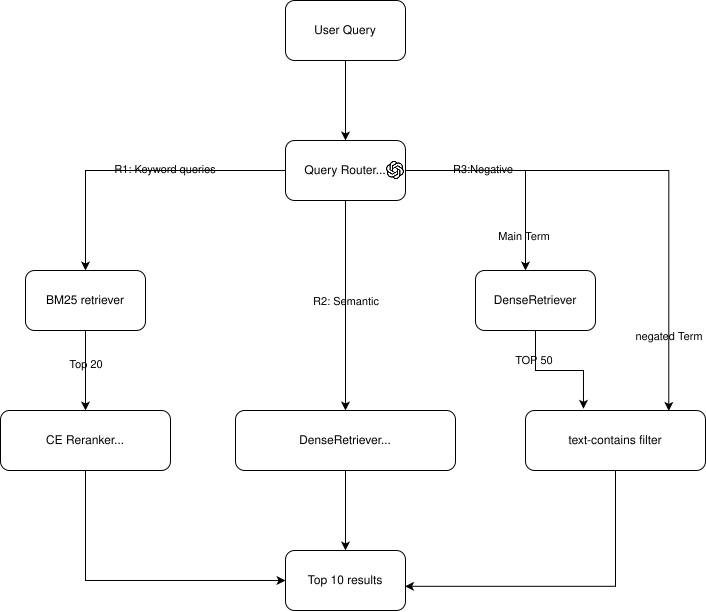

# iFood Semantic Search System

A semantic search system for iFood's food delivery catalog that processes Portuguese search queries across three categories — **keyword**, **semantic**, and **hard negative** — and returns the most relevant food items from a 5,000-item database.

## Architecture

The system uses a **query-aware routed pipeline** that classifies each query and dispatches it to the optimal retrieval strategy:



**Routes:**

| Route | Query Type | Strategy | Example |
|-------|-----------|----------|---------|
| R1 | Keyword — short, specific | BM25 → Cross-Encoder rerank | "Pizza", "Sushi" |
| R2 | Semantic — descriptive/conceptual | Dense retrieval (embedding similarity) | "Jantar romantico com massa" |
| R3 | Negative — explicit exclusion with "sem" | Dense on main term → text-contains filter to remove violations | "Macarrao sem frutos do mar" |

**Key components:**
- **BM25Retriever** — Lexical matching via BM25Plus with simple whitespace tokenization
- **DenseRetriever** — Embedding similarity using `google/embeddinggemma-300m` (local, 768d) or `text-embedding-3-large` (API). Brute-force cosine search over normalized vectors — fast enough for 5K items (<1ms)
- **CrossEncoderReranker** — `BAAI/bge-reranker-v2-m3` for R1 keyword reranking
- **QueryRouter** — GPT-4o-mini classifier that extracts route, main term, and negated term for R3 queries
- **Negation filter** — Text-contains check on dense candidates, splitting compound negations on " e " (Portuguese "and")

## Setup

### Prerequisites

- Python 3.12+
- [uv](https://docs.astral.sh/uv/) package manager

### Installation

```bash
git clone git@github.com:PirxTion/iFood.git
cd iFood
uv sync
```

### API Keys

The system uses two API endpoints:

```bash
# OpenAI API — used for query routing, ground truth generation, training data generation
export OPENAI_API_KEY="your-openai-key"

```

### Data

Place the provided dataset files in `data/`:
```
data/
  queries.csv       # 60 queries (20 keyword, 20 semantic, 20 negative)
  5k_items.csv      # 5,000 food items with metadata and profiles
```

## Usage

### Interactive Search

```bash
# Routed pipeline (default) — auto-classifies query type
uv run python run_search.py "Almoço estilo havaiano"

# Single-query with explicit mode
uv run python run_search.py --mode dense "Pizza"

# Interactive mode
uv run python run_search.py
```

### Evaluation Pipeline

```bash
# 1. Build ground truth (LLM-as-judge, ~780 API calls)
uv run python run_eval.py --build-gt

# 2. Evaluate different pipeline configurations
uv run python run_eval.py --evaluate bm25 --k 10
uv run python run_eval.py --evaluate dense --k 10
uv run python run_eval.py --evaluate hybrid --k 10
uv run python run_eval.py --evaluate routed --k 10
```

Each evaluation run produces:
- **Metrics JSON** in `eval_data/eval_<mode>.json` — per-category NDCG, MRR, precision, recall, NCVR
- **Run report** in `eval_data/run_<mode>_<timestamp>.json` — full per-query traces with per-stage timing

### Fine-Tuning

```bash
# 1. Generate synthetic training data via OpenAI Batch API (~8K-10K pairs)
uv run python scripts/generate_training_data.py

# 2. Fine-tune EmbeddingGemma-300m
uv run python scripts/train_embedding.py --epochs 3 --batch-size 64

# 3. Evaluate fine-tuned model (update EMBEDDING_MODEL in src/config.py first)
uv run python run_eval.py --evaluate routed --k 10
```

### Diagnostic Tools

```bash
# Inspect what the system returned for a specific query
uv run python scripts/inspect_run.py eval_data/run_routed_<timestamp>.json

# Inspect what ground truth expects
uv run python scripts/inspect_ground_truth.py

# Or use the combined script (edit the query= variable inside first)
bash inspect_query.sh
```

## Evaluation Methodology

No ground truth was provided — we designed our own evaluation pipeline.

### Ground Truth Generation (LLM-as-Judge)

A two-round tournament using GPT-4o-mini:

1. **Round 1 (Coarse filter):** Split 5K items into batches of 500. LLM selects top candidates per batch. Run 2 times per batch, union results → ~100-150 candidates per query.
2. **Round 2 (Fine scoring):** All candidates in a single call. LLM assigns 0-3 relevance grades. Run 3 times, take **median** per item to reduce noise.

Design choices:
- **Integer indices** instead of UUIDs in prompts — reduced LLM item-ID hallucination from ~33% to near zero
- **Fixed random seed** for deterministic batch ordering and reproducible results
- **Single-call Round 2** to avoid cross-batch calibration drift
- Negative queries additionally receive **violation flags** in Round 2

### Metrics

| Metric | Description |
|--------|-------------|
| NDCG@K | Normalized Discounted Cumulative Gain with graded relevance (0-3) |
| MRR | Mean Reciprocal Rank — position of first relevant result |
| P@K | Precision at K — fraction of top-K that are relevant |
| R@K | Recall at K — fraction of all relevant items retrieved |
| **NCVR@K** | Negative Constraint Violation Rate — fraction of top-K violating "sem X" constraints |
| **Penalized NDCG@K** | Violations scored at -3 (same magnitude as max +3 relevance), so one violation roughly cancels one perfect match |

NCVR and Penalized NDCG are custom metrics designed for this task — standard IR metrics treat constraint violations the same as irrelevant results, but for a user searching "pizza sem queijo," getting pizza *with* cheese is actively worse than getting an unrelated item.

## Results

### Final System (Routed Pipeline, EmbeddingGemma-300m with prompt templates)

| Category | NDCG@10 | MRR | P@10 | R@10 | Penalized NDCG | NCVR |
|----------|---------|-----|------|------|----------------|------|
| **Overall** | **0.669** | 0.774 | 0.572 | 0.324 | — | 0.059 |
| Keyword | 0.849 | 0.958 | 0.785 | 0.352 | — | — |
| Semantic | 0.540 | 0.697 | 0.389 | 0.230 | — | — |
| Negative | 0.607 | 0.658 | 0.532 | 0.388 | 0.543 | 0.179 |

### Pipeline Comparison

| Pipeline | NDCG@10 | Key Finding |
|----------|---------|-------------|
| Dense only (e5-small) | 0.479 | Small models lack cultural knowledge |
| Dense only (te3-large) | 0.616 | World knowledge = +29% NDCG |
| Hybrid BM25+Dense (RRF) | 0.562 | RRF degrades dense on all categories |
| Dense + CE reranker | 0.600 | CE reranker hurts semantic, amplifies violations |
| Routed + BM25 negation | 0.593 | BM25 top-50 has zero overlap with dense — useless |
| **Routed + text filter** | **0.660** | Simple string matching (<1ms) beats 2.3s cross-encoder |

### Embedding Model Comparison

| Model | Dim | NDCG@10 | Local? | Notes |
|-------|-----|---------|--------|-------|
| multilingual-e5-small | 384 | 0.468 | Yes | Lacks world knowledge |
| BAAI/bge-m3 | 1024 | 0.479 | Yes | High-frequency term bias |
| google/embeddinggemma-300m | 768 | 0.491 | Yes | Before prompt templates |
| **embeddinggemma + prompts** | 768 | **0.602** | Yes | +0.111 NDCG from prompt templates alone |
| text-embedding-3-large | 3072 | 0.616 | No | Best absolute quality |
| text-embedding-3-large | 768 | 0.595 | No | 4x smaller, -2pts NDCG |

Notable: EmbeddingGemma with prompt templates (0.602) matches te3-large@768d (0.595), achieving commercial API quality with a local 300M-param model at zero API cost.

## Fine-Tuning

### Approach: Contrastive Learning with Synthetic Data

**Base model:** `google/embeddinggemma-300m` (300M params, 768d, 100+ languages)

**Training data generation:**
- GPT-4o-mini generates two query types per item via the OpenAI Batch API:
  - **Semantic-gap queries** — conceptual/cultural/occasion-based, e.g., item "Poke Tropical" → query "almoço estilo havaiano"
  - **Direct queries** — different vocabulary than item name, e.g., "tigela de peixe cru com arroz"
- ~8,000-10,000 (query, item) pairs total

**Training:**
- Loss: `MultipleNegativesRankingLoss` — each batch of N pairs produces N positives and N*(N-1) in-batch negatives
- Prompt-aware training: query and document columns are mapped to EmbeddingGemma's built-in prompt templates
- 3 epochs, batch size 64, learning rate 2e-5, early stopping on validation loss

**Goal:** Close the semantic gap where the model doesn't know cultural associations (e.g., "havaiano" → poke bowls, "mezze" → hummus/falafel).

## Project Structure

```
prosus-assignment/
├── run_search.py                  # Interactive search CLI
├── run_eval.py                    # Evaluation & ground truth pipeline
├── src/
│   ├── config.py                  # All hyperparameters and model configs
│   ├── data_loader.py             # CSV parsing, item text construction
│   ├── retrieval/
│   │   ├── bm25_retriever.py      # BM25Plus lexical retrieval
│   │   ├── dense_retriever.py     # Embedding-based retrieval (local + API)
│   │   ├── hybrid_retriever.py    # RRF fusion
│   │   ├── llm_reranker.py        # LLM + CrossEncoder rerankers
│   │   └── query_router.py        # LLM query classifier (R1/R2/R3)
│   └── eval/
│       ├── metrics.py             # NDCG, MRR, P@K, NCVR, Penalized NDCG
│       ├── evaluate.py            # Per-category evaluation with tracing
│       ├── build_ground_truth.py  # Tournament-style LLM judging
│       ├── tracing.py             # Per-stage latency tracing
│       └── run_report.py          # Unified JSON run reports
├── scripts/
│   ├── generate_training_data.py  # Synthetic pair generation (Batch API)
│   ├── train_embedding.py         # EmbeddingGemma fine-tuning
│   ├── inspect_run.py             # Diagnose system output for a query
│   ├── inspect_ground_truth.py    # View ground truth for a query
│   └── run_ground_truth.py        # Standalone GT generation runner
├── tests/                         # Unit tests (pytest)
├── pyproject.toml                 # Dependencies (managed by uv)
└── uv.lock                        # Locked dependency versions
```

## Key Design Decisions

1. **Eval-first development** — Built the evaluation pipeline before any retrieval component, ensuring every change was measurable from day one.

2. **Routing > fusion** — Hybrid retrieval (BM25+Dense via RRF) consistently degraded dense-only results. Query-type-aware routing lets each query type get its optimal retrieval path.

3. **Simple negation filter > cross-encoder** — The CE reranker was trained on relevance, not constraint satisfaction. It pushed violations *back* to the top, undoing the text filter's work. Removing it improved negative NDCG by +12.8 points and cut P90 latency from 4.0s to 1.5s.

4. **Prompt templates matter** — EmbeddingGemma jumped +0.111 NDCG simply by using its built-in asymmetric prompt templates. Without them, the model couldn't distinguish queries from documents.

5. **Penalized NDCG for negation** — Standard metrics don't distinguish "irrelevant" from "actively harmful." Our custom metric scores violations at -3, capturing the real user experience cost.
